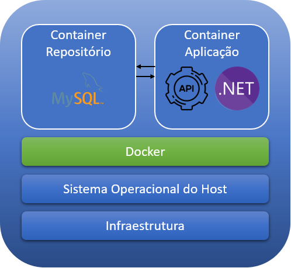
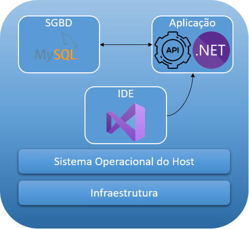
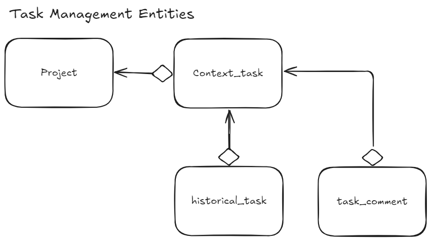

# Sistema de gerenciamento de tarefas

## 1. Objetivo
Disponibilizar API que permite aos usuários organizar e monitorar suas tarefas diárias, bem como colaborar com colegas de equipe.

## 2. Arquitetura
O padrão adotado para a solução foi o "Clean Architecture", pois essa  arquitetura resulta em um projeto com boa separação de responsabilidades, testabilidade, e manutenibilidade.

Ela emprega o Princípio da Inversão de Dependência (DIP, do SOLID), e também princípios do Domain Driven Design.

Essa arquitetura tem como núcleo central a lógica de negócio do domínio, que concentra tanto a definição do Domínio, quanto outros elementos como interfaces de Infraestrutura. Em toda sua extensão são usadas abstrações, realizando a inversão de dependência.

Os componentes dela são:

- **User Interface:** em nosso caso, contém a API.
- **Services:** contém responsabilidades relativas a aplicação, como modelos de entrada e saída, e serviços da aplicação.
- **Infrastructure:** contém implementação de responsabilidades relativas a infraestrutura, como acesso bancos de dados.
- **Domain:** contém os modelos de domínio, como entidades, enums, exceções de domínio.
- **Core:** contém infraestrutura para envelopamento de resultados, bem como modelos de validação.

## 3. Repositório

Foi escolhido o MySQL como sistema de gerenciamento de banco de dados relacional devido a robustez e por ser amplamente utilizado.

## 4. Pré-requisitos
### Depuração
- .NET 
- [Visual Studio](https://visualstudio.microsoft.com/pt-br/vs/community/) 
- [MySQL](https://dev.mysql.com/downloads/mysql/)

### Execução
- [Docker Desktop](https://www.docker.com/products/docker-desktop/)

## 5. Construção do ambiente

Existe mais de um cenário possível para construção do ambiente de desenvolvimento / depuração, abaixo estão descritas algumas possibilidades. Após escolher o cenário que desejar, vá diretamente a respectiva seção para seguir as etapas.

### Ambiente implantado em Docker
Utilizado para visualização da entrega final, serve como ambiente de homologação, mas pode ser usado durante o desenvolvimento.

Neste cenário teremos dois containers Docker, um para o repositório e outro para a aplicação, sendo que a aplicação irá se conectar na base de dados existente no container próprio.

### Ambiente convencional de desenvolvimento
Como o nome já diz: utilizado para o desenvolvimento, mas permite que o sistema seja usado para testes e validações.

Neste cenário, a base de dados é gerenciada pelo MySQL que está instalado no Host, da mesma forma que a aplicação será gerenciado pelo .NET, sendo possível depurar pelo Visual Studio.

### Ambiente de desenvolvimento usando repositório no Docker
É um ambiente de desenvolvimento, porém os binários são instalados em um container Docker (podendo ainda ser depurado).

Neste cenário, a base de dados estará em um container Docker também que será acessado pela API que foi instalada no container que foi gerenciado pelo Visual Studio.

## 5.1 Ambiente implantado em Docker

### 5.1.1 Criar imagem MySQL
Abra o 'Prompt de comando' na pasta base do repositório e digite o comando abaixo:

	docker build -t mysql-image -f Database\Dockerfile .

Será criada uma imagem do MySQL com a senha do usuário **root** pré-definida como _mlt2024!_

### 5.1.2 Criar imagem dotnet contendo a API
Altere a pasta atual para "Task-Management" e digite o comando para criar a nova imagem:

	CD Task-Management
	docker build -t task_mgmt-image -f Dockerfile .

Uma nova imagem será criada contendo o build da API.

### 5.1.3 Criar o container usando a imagem MySQL

Se desejar que a base de dados mantenha o estado dos dados somente enquanto o container estiver sendo executado (perdendo os dados quando o mesmo for parado):

	docker run -d --rm --name mysql-container mysql-image
	
	
Caso tenha interesse em conservar os dados mesmo após o container ser parado, acrescente o caminho para criar o "volume".
A linha de comando deve variar de acordo com o seu 'host' e maneira de executar o comando do Docker, porém em todos os casos o diretório atual deverá ser a pasta base do repositório para que os arquivos do volume sejam criados em "Database\data":

_**[Windows]** Prompt de comando:_

	CD ..
	docker run -d -v %CD%\Database\data:/var/lib/mysql --rm --name mysql-container mysql-image
	
_**[Windows]** Powershell_

	CD ..
	docker run -d -v ${PWD}\Database\data:/var/lib/mysql --rm --name mysql-container mysql-image

_**[Linux]** Bash_

	cd ..
	docker run -d -v $(pwd)\Database\data:/var/lib/mysql --rm --name mysql-container mysql-image

### 5.1.4 Criando a base de dados no container do MySQL

	docker exec -i mysql-container mysql -uroot -pmlt2024! < Database\create-table.sql

Caso queira que a base já contenha dados iniciais (massa de dados de teste):

	docker exec -i mysql-container mysql -uroot -pmlt2024! < Database\dados-iniciais.sql

### 5.1.5 Criar o container usando a imagem dotnet + API

	docker run -d -p 24001:8080 --link mysql-container --rm --name taskmgmt-container task_mgmt-image
	
- A porta 8080 que está sendo utilizada pela API no container será mapeada para a porta 24001 para acesso no host;
- O parâmetro "link" serve para informar ao container (que está sendo criado) o nome do container que contém o MySQL que está sendo utilizado na string de conexão da API.

### 5.1.6 Acessar a interface do Swagger

Após subir os dois containers a API estará disponível através do hyperlink:

[http://localhost:24001/swagger/index.html](http://localhost:24001/swagger/index.html)

🆒 Pronto! Agora é só utilizar cada endpoint de acordo com a sua necessidade.

💡 Os demais cenários abaixo só devem servir para usuários que desejam criar ambientes de desenvolvimento!

## 5.2 Ambiente convencional de desenvolvimento

### 5.2.1 Criando a base de dados

Na pasta base do repositório existe uma pasta "Database", dentro dela está disponível o script para criação da base de dados e suas tabelas:
 
	create-table.sql

Compile o script através do IDE de sua preferência (Workbench, HeidiSQL, etc) acessando o uma sessão de MySQL ou ainda por linha de comando, executando `mysql` passando os parâmetros necessários (maiores detalhes de como fazer isso neste [tutorial](https://www.tabnews.com.br/Normal/tutorial-como-executar-o-mysql-8-0-no-prompt-de-comando-cmd)).

Após a compilação será criada base "task_mgmt" e as respectivas tabelas.

## 5.2.2 Atualizando a string de conexão

- Abra o arquivo "appsettings.json" ($\Task-Management\TM.API)
- Remova o comentário da string de conexão `ambiente 2`
- Remova ou comente qualquer outra string de conexão
- Altere o nome do usuário e a respectiva senha com permissão para acesso a base que foi criada no passo anterior.

	- Uid=\<user>
	- Pwd=\<password>

## 5.2.3 Depurando através do  Visual Studio

Para atender a esse tópico será necessário ter instalado uma versão do [Visual Studio](https://visualstudio.microsoft.com/pt-br/vs/community/) (eu utilizei a 'Community 2022').

- Abra o arquivo de solução (Task-Management.sln) na pasta "$\Task-Management"
- Certifique-se que o perfil de depuração seja 'http'

- Em seguida inicie a depuração pressionando \<F5>

O Visual Studio irá abrir a interface do Swagger no browser que estará conectada diretamente a instância da base de dados no MySQL.

## 5.3 Ambiente de desenvolvimento usando repositório no Docker

Este cenário é um híbrido dos dois cenários anteriores e por isso algumas etapas podem ser reaproveitadas!

### 5.3.1 Criar imagem e container MySQL

Repita os mesmos processos da etapas
- 5.1.1 Criar imagem MySQL
- 5.1.3 Criar o container usando a imagem MySQL
- 5.1.4 Criando a base de dados no container do MySQL

Após cumpridas essas etapas a base de dados estará em um container Docker.

## 5.3.2 Atualizando a string de conexão

Digite o comando abaixo e procure na seção `Networks` o `IPAddress` do container MySQL:

	docker inspect mysql-container 

- Abra o arquivo "appsettings.json" ($\Task-Management\TM.API)
- Remova o comentário da string de conexão `ambiente 3`
- Atualize o endereço IP do Server com o mesmo valor que foi encontrado no 'inspect'
- Remova ou comente qualquer outra string de conexão

## 5.3.3 Visual Studio gerenciando o processo de deploy no Docker

Para atender a esse tópico será necessário ter instalado uma versão do [Visual Studio](https://visualstudio.microsoft.com/pt-br/vs/community/) (eu utilizei a 'Community 2022') e o [Docker Desktop](https://www.docker.com/products/docker-desktop/) deve estar em execução.

- Abra o arquivo de solução (Task-Management.sln) na pasta "$\Task-Management"
- Altere o perfil de depuração para 'Container (Dockerfile)'

- Em seguida inicie a depuração pressionando \<F5>

O Visual Studio irá gerar uma imagem de nome **tmapi** e fará o deploy do container **TM.API**, ao final o seu browser padrão será aberto carregando a interface do Swagger da API, permitindo que os endpoints sejam utilizados.

	A diferença deste cenário para o primeiro é que o gerenciamento da imagem e container Docker ficam a cargo do Visual Studio, porém a string de conexão estará apontando para o container do MySQL que foi gerado na 5.3.1.

# Fase 2: Refinamento

### Validações
Na especificação inicial não constam detalhes para validação dos objetos, como por exemplo: "tarefa não pode ter título vazio", por isso seria interessante gerar cenários de validação para cada entidade para melhorar a robustez da aplicação.

### Paginação
Os endpoints de verbo GET não foram implementados levando em consideração a paginação. Seria interessante gerar uma versão 2 ou refatorar a versão atual incluindo a paginação, pois a medida que aumentar o volume de dados a performance desses endpoints será impactada devido ao tempo de serialização dos dados em JSON.

### Configurações do sistema
Para que a quantidade limite de tarefas por projeto (atualmente em 20) não estivesse escrita diretamente no código-fonte, esse dado foi inserido no arquivo "appsettings.json" permitindo que o valor seja alterado conforme a necessidade sem que haja necessiade de uma nova compilação e deploy do sistema. 

Contudo, mesmo utilizando o expediente atual ainda será necessário que o ocorra um 'reload' da API após a atualização do arquivo JSON.

Portanto a alternativa seria migrar essa coonfiguração (e outras que sejam necessárias) para uma tabela de confihgurações dentro da base de dados, substituindo o atual acesso ao "arquivo de configuração" por uma obtenção das configurações através do repositório, isso irá permitir maior agilidade na atualização e disponibilização da configuração, bem como, estender a funcionalidade a outras necessidade de configuração.

# Fase 3: Final

### Melhorias propostas:

- Validação utilizando FluentValidation;
- Integração com o serviço externo de autenticação;
- Implementar uma funcionalidade para que os usuários sejam notificados assim que uma tarefa for atribuída a ele ou quando a tarefa que já foi atribuída sofra alguma atualização.