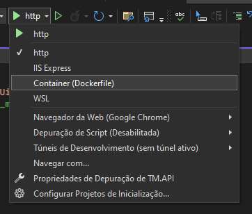

# Sistema de gerenciamento de tarefas

## 1. Objetivo
Disponibilizar API que permite aos usuários organizar e monitorar suas tarefas diárias, bem como colaborar com colegas de equipe.

## 2. Arquitetura
O padrão adotado para a solução foi o "Clean Architecture", pois essa  arquitetura resulta em um projeto com boa separação de responsabilidades, testabilidade, e manutenibilidade.

Ela emprega o Princípio da Inversão de Dependência (DIP, do SOLID), e também princípios do Domain Driven Design.

Essa arquitetura tem como núcleo central a lógica de negócio do domínio, que concentra tanto a definição do Domínio, quanto outros elementos como interfaces de Infraestrutura. Em toda sua extensão são usadas abstrações, realizando a inversão de dependência.

Os componentes dela são:

- **User Interface:** em nosso caso, contém a API.
- **Services:** contém responsabilidades relativas a aplicação, como modelos de entrada e saída, e serviços da aplicação.
- **Infrastructure:** contém implementação de responsabilidades relativas a infraestrutura, como acesso bancos de dados.
- **Domain:** contém os modelos de domínio, como entidades, enums, exceções de domínio.
- **Core:** contém infraestrutura para envelopamento de resultados, bem como modelos de validação.

## 3. Repositório

Foi escolhido o MySQL como sistema de gerenciamento de banco de dados devido a robustez e facilidade de instalação.

## 4. Pré-requisitos
### Depuração
- .NET 
- Visual Studio 
- MySQL

### Execução
- Docker

## 5. Criando a base de dados

Na pasta base do repositório existe uma pasta "Database", dentro dela está disponível o script para criação da base de dados e suas tabelas:
 - script-inicial.sql

Compile o script através do IDE de sua preferência (Workbench, HeidiSQL, etc) acessando o uma sessão de MySQL. 

Após a compilação será criada base "task_mgmt" e as respectivas tabelas.

## 6. Atualizando a string de conexão

Abra o arquivo "appsettings.json" ($\Task-Management\TM.API) e altere o nome do usuário e a respectiva senha com permissão para acesso a base que foi criada no passo anterior.

- Uid=\<user>
- Pwd=\<password>

## 7. Depurando através do  Visual Studio

Para atender a esse tópico será necessário ter instalado uma versão do [Visual Studio](https://visualstudio.microsoft.com/pt-br/vs/community/) (eu utilizei a 'Community 2022') e o [Docker Desktop](https://www.docker.com/products/docker-desktop/) deve estar em execução.

- Abra o arquivo de solução (Task-Management.sln) na pasta "$\Task-Management"
- Altere o perfil de depuração para 'Container(Dockerfile)'

- Em seguida inicie a depuração pressionando \<F5>

O Visual Studio irá gerar uma imagem de nome **tmapi** e fará o deploy do container **TM.API**, ao final o seu browser padrão será aberto carregando a interface do Swagger da API, permitindo que os endpoints sejam utilizados.

## 8. Criação da imagem Docker
Estando na pasta base da solução ($\Task-Management) execute a linha de comando:

	docker build --pull --rm -f "TM.API\Dockerfile" -t tmapi:dev "." 

Para criar (e executar) o container:

	docker run -d -p 32768:8080 --name TM.API tmapi:dev

## 9. Acessando a API 

O container irá expor na porta 32768 do host o conteúdo da porta 8080 da imagem, portanto a interface do Swagger estará disponível em:

http://localhost:32768/swagger/index.html

# Fase 2: Refinamento

### Validações
Na especificação inicial não constam detalhes para validação dos objetos, como por exemplo: "tarefa não pode ter título vazio", por isso seria interessante gerar cenários de validação para cada entidade para melhorar a robustez da aplicação.

### Paginação
Os endpoints de verbo GET não foram implementados levando em consideração a paginação. Seria interessante gerar uma versão 2 ou refatorar a versão atual incluindo a paginação, pois a medida que aumentar o volume de dados a performance desses endpoints será impactada devido ao tempo de serialização dos dados em JSON.

### Configurações do sistema
Para que a quantidade limite de tarefas por projeto (atualmente em 20) não estivesse escrita diretamente no código-fonte, esse dado foi inserido no arquivo "appsettings.json" permitindo que o valor seja alterado conforme a necessidade sem que haja necessiade de uma nova compilação e deploy do sistema. 

Contudo, mesmo utilizando o expediente atual ainda será necessário que o ocorra um 'reload' da API após a atualização do arquivo JSON.

Portanto a alternativa seria migrar essa coonfiguração (e outras que sejam necessárias) para uma tabela de confihgurações dentro da base de dados, substituindo o atual acesso ao "arquivo de configuração" por uma obtenção das configurações através do repositório, isso irá permitir maior agilidade na atualização e disponibilização da configuração, bem como, estender a funcionalidade a outras necessidade de configuração.

# Fase 3: Final

### Melhorias propostas:

- Validação utilizando FluentValidation;
- Integração com o serviço externo de autenticação;
- Implementar uma funcionalidade para que os usuários sejam notificados assim que uma tarefa for atribuída a ele ou quando a tarefa que já foi atribuída sofra alguma atualização.